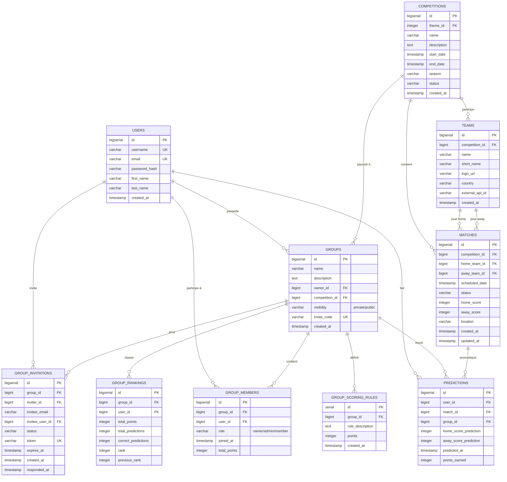

# FrozenBet API - Hockey Predictions Platform

A complete REST API for a hockey predictions platform where users can create groups, make predictions on matches, and compete with friends.

## Features

- **User Authentication**: JWT-based authentication with registration, login, and profile management
- **Groups Management**: Create public/private groups with invite codes
- **Match Predictions**: Make predictions on upcoming matches with validation
- **Scoring System**: Automatic points calculation based on customizable rules
- **Rankings**: Real-time leaderboards and statistics
- **API Documentation**: Interactive Swagger/OpenAPI documentation

## Tech Stack

- **Backend**: Express.js (Node.js) with TypeScript
- **Database**: PostgreSQL (Vercel) with Prisma ORM
- **Real-time**: Server-Sent Events (SSE) for live scores
- **Authentication**: JWT (JSON Web Tokens)
- **Validation**: Zod schemas
- **Documentation**: Swagger/OpenAPI auto-generated
- **Security**: Helmet, CORS, Rate Limiting

## Prerequisites

- Node.js (v18 or higher)
- npm or yarn

## Installation

1. Clone the repository:

```bash
git clone <repository-url>
cd FrozenBetApi
```

2. Install dependencies:

```bash
npm install
```

3. Setup environment variables:

```bash
cp .env.example .env
```

Edit `.env` and configure your settings (especially JWT_SECRET for production).

4. Generate Prisma client and run migrations:

```bash
npm run db:generate
npm run db:migrate
```

## Running the Application

### Development Mode

```bash
npm run dev
```

The server will start on `http://localhost:8000`

### Production Mode

```bash
npm run build
npm start
```

## API Documentation

Once the server is running, access the interactive API documentation at:

**http://localhost:8000/api/docs**

## API Endpoints

### Authentication (`/api/auth`)

- `POST /api/auth/register` - Register a new user
- `POST /api/auth/login` - Login and receive JWT token
- `GET /api/auth/me` - Get current user profile
- `PUT /api/auth/me` - Update user profile
- `POST /api/auth/change-password` - Change password

### Groups (`/api/groups`)

- `GET /api/groups` - List all public groups
- `POST /api/groups` - Create a new group
- `GET /api/groups/:id` - Get group details
- `PUT /api/groups/:id` - Update group (owner/admin only)
- `DELETE /api/groups/:id` - Delete group (owner only)
- `POST /api/groups/:id/join` - Join a group
- `POST /api/groups/:id/leave` - Leave a group
- `GET /api/groups/:id/members` - Get group members
- `DELETE /api/groups/:id/members/:userId` - Remove a member

### Predictions (`/api/predictions`)

- `GET /api/predictions` - Get user's predictions
- `POST /api/predictions` - Create a new prediction
- `PUT /api/predictions/:id` - Update a prediction (before match starts)

### Matches (`/api/matches`)

- `GET /api/matches` - Get all matches (with filters)
- `GET /api/matches/upcoming` - Get upcoming matches
- `GET /api/matches/live` - Get live matches
- `GET /api/matches/:id` - Get match details
- `GET /api/matches/:matchId/groups/:groupId/predictions` - Get predictions for a match

### SSE - Live Scores (`/api/sse`)

- `GET /api/sse/live-scores` - Subscribe to real-time score updates via SSE
- `GET /api/sse/status` - Get SSE service status and active clients

## Database Schema

The application uses the following main entities:

- **Users**: Platform users with authentication
- **Competitions**: Hockey competitions/leagues
- **Teams**: Teams participating in competitions
- **Matches**: Individual matches between teams
- **Groups**: User-created prediction groups
- **GroupMembers**: Users belonging to groups
- **Predictions**: User predictions on matches
- **GroupScoringRules**: Customizable scoring rules per group
- **GroupRankings**: Cached rankings for performance



## Scoring System

The default scoring rules are:

- **Exact Score**: 5 points
- **Correct Winner**: 3 points
- **Correct Draw**: 3 points

Groups can customize these rules through the API.

## Security Features

- Password hashing with bcrypt
- JWT token authentication
- Rate limiting (100 requests per 15 minutes)
- CORS protection
- Helmet security headers
- Input validation with Zod
- SQL injection protection via Prisma

## Environment Variables

```env
# Database - PostgreSQL on Vercel
POSTGRES_URL="postgres://your-connection-string"
DATABASE_URL="postgres://your-connection-string"
PRISMA_DATABASE_URL="prisma+postgres://accelerate.prisma-data.net/?api_key=your-api-key"

# JWT
JWT_SECRET="your-super-secret-jwt-key-change-this-in-production"
JWT_EXPIRATION="24h"
REFRESH_TOKEN_EXPIRATION="7d"

# Server
PORT=8000
NODE_ENV=development

# CORS
CORS_ORIGINS="http://localhost:3000,http://localhost:8000"

# Logging
LOG_LEVEL=info
```

**See [MIGRATION_POSTGRESQL.md](MIGRATION_POSTGRESQL.md) for complete database setup guide.**

## Prisma Commands

```bash
# Generate Prisma Client
npm run db:generate

# Create a migration
npm run db:migrate

# Push schema to database (without migration)
npm run db:push

# Open Prisma Studio (database GUI)
npm run db:studio
```

## Project Structure

```
FrozenBetApi/
├── prisma/
│   ├── schema.prisma          # Database schema
│   └── migrations/            # Database migrations
├── src/
│   ├── config/                # Configuration files
│   │   ├── database.ts        # Prisma client setup
│   │   └── env.ts             # Environment config
│   ├── middleware/            # Express middleware
│   │   ├── auth.ts            # Authentication middleware
│   │   └── errorHandler.ts   # Error handling
│   ├── routes/                # API routes
│   │   ├── auth.routes.ts
│   │   ├── group.routes.ts
│   │   ├── match.routes.ts
│   │   └── prediction.routes.ts
│   ├── services/              # Business logic
│   │   ├── auth.service.ts
│   │   ├── group.service.ts
│   │   └── prediction.service.ts
│   ├── utils/                 # Utility functions
│   │   ├── jwt.ts             # JWT utilities
│   │   ├── password.ts        # Password hashing
│   │   ├── response.ts        # API response helpers
│   │   └── inviteCode.ts      # Invite code generation
│   ├── validators/            # Zod validation schemas
│   │   ├── auth.validator.ts
│   │   ├── group.validator.ts
│   │   └── prediction.validator.ts
│   └── index.ts               # Application entry point
├── .env                       # Environment variables
├── .env.example               # Example environment file
├── package.json               # Dependencies and scripts
├── tsconfig.json              # TypeScript configuration
└── README.md                  # This file
```

## Usage Examples

### Register a User

```bash
curl -X POST http://localhost:8000/api/auth/register \
  -H "Content-Type: application/json" \
  -d '{
    "username": "johnwick",
    "email": "john@example.com",
    "password": "SecureP@ss123",
    "firstName": "John",
    "lastName": "Wick"
  }'
```

### Login

```bash
curl -X POST http://localhost:8000/api/auth/login \
  -H "Content-Type: application/json" \
  -d '{
    "email": "john@example.com",
    "password": "SecureP@ss123"
  }'
```

### Create a Group (requires authentication)

```bash
curl -X POST http://localhost:8000/api/groups \
  -H "Content-Type: application/json" \
  -H "Authorization: Bearer YOUR_JWT_TOKEN" \
  -d '{
    "name": "Montreal Canadiens Fans",
    "description": "Predictions group for Habs fans",
    "competitionId": 1,
    "visibility": "public"
  }'
```

### Make a Prediction

```bash
curl -X POST http://localhost:8000/api/predictions \
  -H "Content-Type: application/json" \
  -H "Authorization: Bearer YOUR_JWT_TOKEN" \
  -d '{
    "matchId": 1,
    "groupId": 1,
    "homeScorePrediction": 3,
    "awayScorePrediction": 2
  }'
```

## Error Handling

The API uses standardized error responses:

```json
{
  "success": false,
  "error": {
    "code": "ERROR_CODE",
    "message": "Human-readable error message",
    "details": []
  }
}
```

Common error codes:

- `VALIDATION_ERROR` - Invalid input data (422)
- `UNAUTHORIZED` - Authentication required (401)
- `FORBIDDEN` - Insufficient permissions (403)
- `NOT_FOUND` - Resource not found (404)
- `CONFLICT` - Resource already exists (409)

## Testing

The API can be tested using:

- **Swagger UI**: http://localhost:8000/api/docs
- **Postman**: Import the OpenAPI spec
- **cURL**: Command-line testing (see examples above)
